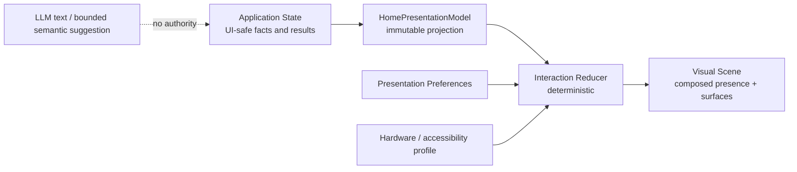

# UI-02.5 — Presentation Model & Home Interaction Contract

Status: **DESIGN COMPLETE; FOUNDATION IMPLEMENTED BY UI-03**

Date: **2026-08-11**

This document refines
[`UI-02_INTERACTION_PRESENCE_DESIGN.md`](UI-02_INTERACTION_PRESENCE_DESIGN.md)
into a framework-independent presentation contract. It defines what a future
frontend must be able to render, not how it must be implemented.

## 1. Home conceptual model

Masha Home is one primary desktop window perceived as Masha's home. Masha exists
inside the room; functions appear around her and transform the room according to
the current activity.

The target experience is:

```text
I came home
→ Masha is here
→ I can speak immediately
→ I can ask her to do bounded work
→ I can see what is actually happening
→ I understand the limits of her autonomy
→ I can intervene at any moment
```

This metaphor does not turn the application into a game. It governs composition,
continuity and interaction priority while ordinary desktop controls remain
available for precision, accessibility and safety.

### 1.1 Design qualities

- modern, high-quality desktop space;
- warm and recognisable rather than sterile;
- cinematic and spatial, but not cyberpunk decoration;
- visually rich when hardware permits, fully functional when it does not;
- emotionally present without hiding machine limits or permissions;
- no pixel art, toy-like avatar widget, dashboard grid or permanent card wall.

### 1.2 Persistent and contextual composition

Home contains two categories of elements.

**Persistent elements** preserve orientation and continuity:

- Masha's presence, or an explicit compact/hidden-presence substitute;
- the room/background plane;
- a minimal orientation layer and return-to-Home affordance;
- an immediately reachable conversation input;
- global safety truth;
- local runtime/model availability truth.

**Contextual elements** appear only when they have a purpose:

- Conversation Surface;
- Activity Surface;
- Agent Task Surface;
- Memory Surface;
- Commitment Surface;
- Proactive Surface;
- Confirmation Surface;
- Media Surface;
- Skills / Permissions Surface;
- Model / Runtime Surface;
- future Voice Surface;
- future external-event or device Surface, after its own trusted boundary exists.

Persistent does not mean visually loud. Safety and orientation can be compact,
but they must remain discoverable and unambiguous.

## 2. Presentation pipeline



The frontend consumes an immutable presentation projection. It must not query
repositories, parse human labels or infer domain truth from generated text.

### 2.1 Conceptual root model

```text
HomePresentationModel
  revision                 monotonic presentation revision
  observed_at              local aware timestamp
  home_state               ready | degraded | unavailable
  presence                 MashaPresence
  surfaces                 ordered InteractionSurface[]
  overlays                 OperatingOverlays
  navigation               NavigationState
  preferences              EffectivePresentationPreferences
  privacy                  EffectiveVisibility
```

This is a conceptual contract, not a production Pydantic class in UI-02.5.

`revision` orders presentation updates inside one local UI process. It is not an
audit ID, Memory version or domain event identity. `observed_at` is display
metadata and never replaces Temporal Engine truth.

### 2.2 Ownership

| Layer | Owns | Does not own |
|---|---|---|
| Application layer | facts, permissions, domain results, stable codes and UI-safe views | layout, animation and visual preference |
| Presentation projection | bounded mapping of application facts to renderable semantics | domain decisions or persistence authority |
| Interaction reducer | surface lifecycle, focus, composition and animation cues | model calls, Memory, safety or proactive decisions |
| Renderer | pixels, authored transitions, input event capture | semantic state or arbitrary capability execution |
| LLM | permitted natural-language formulation | state transitions, layout, animation, safety and frontend commands |

## 3. Shared Room composition

The room has stable spatial roles rather than permanent product panels:

```text
┌───────────────────────────────────────────────────────────────┐
│ Orientation / operating truth                                │
│                                                               │
│ Conversation or contextual surface       Masha Presence       │
│                                                               │
│ Secondary surface                       contextual attention  │
│                                                               │
│ Activity line / decision shelf / input                        │
└───────────────────────────────────────────────────────────────┘
```

### 3.1 Composition slots

`room_focus` is a semantic slot, not a pixel coordinate.

| Slot | Purpose | Capacity |
|---|---|---|
| `presence` | Masha and her immediate state | exactly one |
| `primary` | current user intention | zero or one |
| `supporting` | context needed beside the primary intention | zero to two |
| `decision` | explicit confirmation that blocks only its source operation | zero or one foreground decision; others queue visibly |
| `ambient` | compact status and orientation | bounded persistent set |
| `composer` | text and future voice input | exactly one reachable input path |

Only one surface can be `primary`. A surface never becomes primary merely because
new data arrived; direct user intent, required confirmation or an already
authorised contact is required.

### 3.2 Room transformation rules

1. A direct user action promotes its Surface to `primary`.
2. The former primary Surface becomes `supporting` or `collapsed`; it is not
   destroyed unless its own lifecycle ends.
3. Conversation remains reachable while Activity or Media is primary.
4. A required confirmation appears in `decision`, blocks only the operation that
   requested it and does not disable ordinary conversation.
5. An approved proactive delivery may request attention, but direct user input
   interrupts it and takes priority.
6. Completed context settles into a compact summary, then moves to bounded
   history or closes according to its source contract.
7. Safety, privacy and accessibility constraints are applied before motion or
   spatial transformation.
8. No Surface may turn its visual visibility into backend permission.

### 3.3 Example transformations

| Situation | Room response |
|---|---|
| Misha begins writing | Conversation becomes primary; Masha becomes attentive |
| Turn is submitted | Conversation remains primary; Masha enters processing presentation |
| Long task begins | Activity appears supporting; conversation stays usable |
| Task needs approval | Confirmation occupies decision slot; task becomes waiting |
| Local media is opened | Media becomes primary; conversation collapses to a reachable ribbon |
| Proactive delivery is ready | Masha performs one bounded attention gesture; Proactive Surface appears |
| Emergency stop is engaged | safety overlay changes immediately; autonomous activity motion stops; chat remains |
| Model becomes unavailable | presence remains; speaking/processing becomes unavailable; deterministic controls remain |

## 4. Interaction Surface model

Every contextual capability enters Home through the same declarative Surface
contract. A Surface describes meaning and allowed interaction; it does not ship
frontend code.

```text
InteractionSurface
  surface_id               opaque UI-safe reference
  kind                     SurfaceKind
  lifecycle                SurfaceLifecycle
  role                     primary | supporting | decision | ambient
  title                    human-safe application label
  summary                  optional bounded text
  sensitivity              public | personal | private
  attention                passive | normal | requested | required
  capabilities             explicit SurfaceCapability[]
  activity                 optional ActivityPresentation
  source_reference         optional opaque UI-safe reference
  return_context           optional semantic destination
```

### 4.1 Surface kinds

Initial catalog:

```text
conversation
activity
agent_task
memory
commitment
proactive
confirmation
media
skills
permissions
model_runtime
voice
settings
```

Future capability types extend this catalog through an application-owned
presentation adapter. Unknown types fall back to a safe generic Activity Surface
with a human title, status and details action; they never render arbitrary markup
or execute package code.

### 4.2 Surface lifecycle

```text
hidden → appearing → active → supporting → collapsed → disappearing → closed
                          ↘ decision_required ↗
```

| State | Meaning |
|---|---|
| `hidden` | known but not currently rendered |
| `appearing` | bounded authored transition into the room |
| `active` | primary or directly interacted with |
| `supporting` | visible context beside another primary intention |
| `collapsed` | compact, discoverable and not discarded |
| `decision_required` | source operation waits for explicit user input |
| `disappearing` | authored exit after semantics have ended |
| `closed` | removed from active room composition |

`appearing` and `disappearing` are presentation states only. A renderer may skip
them under reduced motion without changing semantic lifecycle.

### 4.3 Explicit capabilities

A renderer displays an affordance only when the Surface declares it:

```text
inspect
expand
collapse
dismiss
acknowledge
confirm
reject
cancel
pause
resume
retry
```

The frontend must not infer `cancel`, `pause`, `resume`, progress or confirmation
from `kind`. Missing capability means the control does not exist.

## 5. Masha Presence model

Masha's visual presence is composable. It is not one global enum and does not
enumerate every possible combination.

```text
MashaPresence
  visual_identity_id       approved identity reference
  avatar_variant_id        approved presentation variant
  base_pose                BasePose
  expression               ExpressionCue
  attention                AttentionState
  activity                 PresenceActivity
  safety                   SafetyPresence
  ambient                  AmbientPresence
  model_availability       available | switching | unavailable
```

Valid example:

```text
base_pose: speaking
expression: happy / low
attention: toward_user
activity: speaking
safety: autonomy_stopped
ambient: quiet
```

It means Masha is speaking warmly while autonomous activity remains stopped. It
does not imply that safety is bypassed.

### 5.1 Axes

**Base pose**

```text
idle | attentive | speaking | working | waiting | resting | unavailable
```

**Attention**

```text
ambient | toward_user | toward_surface | thinking_away | proactive | interrupted
```

**Presence activity**

```text
idle | listening | processing | speaking | working | waiting |
confirmation | completed | error | unavailable
```

**Safety presence**

```text
autonomy_active | autonomy_stopped
```

**Ambient presence**

```text
active | quiet | privacy | low_power
```

`concerned`, `skeptical`, `slightly_annoyed`, `happy`, `surprised` and tired
appearance belong to expression/pose composition, not activity or safety state.

### 5.2 Combination rules

- `autonomy_stopped` is compatible with ordinary `listening`, `speaking`,
  `happy`, `skeptical` and other conversation presentation.
- `model_availability=unavailable` prohibits `processing` and generated
  `speaking`, but not static presence, settings or deterministic local views.
- `presence.activity=error` suppresses laughing/amused and falls back to
  `serious` or `neutral`.
- `presence.activity=confirmation` suppresses sleepy and laughing expressions.
- `attention=proactive` requires an already authorised delivery-ready event.
- `ambient=privacy` hides sensitive Surface content, not Masha's identity unless
  the user also selects hidden presence.
- reduced motion changes transition/rendering, never semantic state.

## 6. Visual identity and avatar assets

The existing UI-01 `VisualIdentityResolver` remains the only public path to
canonical visual bytes. Paths stay private.

Future presentation assets use this conceptual hierarchy:

```text
Visual Identity
  → approved Avatar Variant
    → Pose Asset
      → Expression Asset / rig parameters
        → authored Transition Set
```

### 6.1 Asset references

```text
AvatarAssetReference
  asset_id                 stable public asset identifier
  visual_identity_id       identity lineage
  variant_id               clothing/environment variant
  pose_id                  optional pose
  expression_support       supported ExpressionCode[]
  presentation_tier        0 | 1 | 2
  media_type               safe display metadata
  integrity_state          verified | unavailable | invalid
```

The UI receives identifiers, supported features and resolved content, never
filesystem paths. Real reference images can seed approved variants in a future
asset-authoring stage. Image generation is not a runtime requirement and cannot
silently replace canonical appearance.

If a requested variant/pose/expression is unavailable, fallback order is:

1. same variant, neutral expression;
2. canonical verified Tier 0 asset;
3. non-image semantic presence placeholder using Masha's name and state.

The fallback never changes Identity or model profile.

## 7. Expression model

UI-02's 16-value catalog remains canonical for the initial design:

```text
neutral, attentive, curious, warm_smile, amused, laughing, thoughtful,
surprised, skeptical, slightly_annoyed, concerned, serious, sympathetic,
happy, proud, sleepy
```

`sleepy` covers the tired/late-idle visual language without creating a duplicate
emotion code.

```text
ExpressionCue
  code                     ExpressionCode
  intensity                0.0..1.0
  source                   state_rule | application_cue | user_preview
  hold                     transient | while_state_active
```

### 7.1 Intensity and fallback

- Default expression intensity is `0.25`.
- Ordinary conversation should normally remain within `0.15..0.60`.
- `laughing` and `surprised` may briefly reach `0.75` after an explicit semantic
  event; constant high intensity is forbidden.
- User presentation preferences can reduce intensity but cannot increase it
  above catalog limits.
- Unknown, invalid or incompatible cues fall back to `neutral / 0.20`.
- Missing expression assets fall back according to the visual-asset chain above.

### 7.2 Priority

```text
safety-compatible constraint
> explicit application state rule
> approved application semantic cue
> ambient/idle expression
```

An LLM may later suggest a provider-independent semantic cue, but the application
must validate it against the catalog. The Presentation Runtime chooses the final
expression and intensity. Text containing “I am angry” is never an animation
command.

### 7.3 Incompatible combinations

| Expression | Incompatible context | Fallback |
|---|---|---|
| `laughing`, `amused` | error, unavailable, safety decision | `serious` |
| `sleepy` | confirmation required, active speaking | `attentive` |
| `proud` | unverified/failed action | `neutral` |
| `concerned` | absence signal alone | `attentive` |
| `slightly_annoyed` | system failure caused by unavailable model | `serious` |
| `surprised` | idle randomisation | `neutral` |

`skeptical` and `slightly_annoyed` are character expressions, never punitive UI
or substitutes for clear disagreement in text.

## 8. Animation contract

Animation is a bounded authored system executed by deterministic local code.

### 8.1 Layers

```text
canonical pose
+ interaction motion
+ expression blend
+ gaze / attention
+ micro-motion
+ future speaking visemes
+ operating overlays
```

Each layer declares amplitude, duration, interruptibility and permitted blend
partners. The renderer clamps every parameter.

### 8.2 Transition contract

```text
AnimationTransition
  from_state               catalog state or wildcard authored rule
  to_state                 catalog state
  duration_class           immediate | short | normal | slow
  blend_profile            cut | crossfade | pose_blend | expression_blend
  interruptible            boolean
  reduced_motion_fallback  cut | short_crossfade | static_swap
```

No LLM output can create an `AnimationTransition`.

### 8.3 Procedural rules

- blink, breathing and micro-gaze use bounded timers and cooldowns;
- seeded variation avoids repetition while remaining reproducible in tests;
- gaze targets only known UI anchors;
- no free inverse-kinematics target is accepted from text/model output;
- no continuous random head movement or camera-relative jitter;
- physically incompatible pose changes must pass through an authored neutral or
  bridge pose;
- a hidden/unfocused window suspends nonessential animation;
- reduced motion removes spatial drift, pulses and long blends;
- GPU degradation lowers detail/frame rate or tier, not semantic fidelity.

The same semantic transition must remain understandable at Tier 0 as a static
asset swap plus text/icon state.

## 9. Activity Surface

Activity is a first-class observable work surface, not a chat bubble or loading
placeholder.

```text
ActivityPresentation
  activity_id              opaque UI-safe reference
  kind                     conversation | proactive | agent | media | system
  state                    ActivityState
  title                    human-safe label
  summary                  current verified fact
  progress                 ProgressPresentation
  steps                    bounded ActivityStep[]
  started_at               optional
  updated_at               required
  capabilities             explicit SurfaceCapability[]
  reason_code              optional stable code
  reason_label             optional human label
```

### 9.1 Activity states

```text
active
waiting
requires_confirmation
paused
waiting_external
completed
failed
cancelled
blocked
unavailable
unknown
```

| State | Semantics |
|---|---|
| `active` | verified work is currently progressing |
| `waiting` | no work is claimed; waiting condition is explicit |
| `requires_confirmation` | source operation cannot continue without Misha |
| `paused` | resumable pause is confirmed by source runtime |
| `waiting_external` | source runtime has a trusted external wait contract |
| `completed` | deterministic verification proved success |
| `failed` | execution or verification failed |
| `cancelled` | source runtime confirmed cancellation |
| `blocked` | permission, safety or budget boundary prevents progress |
| `unavailable` | required local component is unavailable |
| `unknown` | state cannot be proven; UI must not guess |

Current Agent Loop does not implement `paused`, `waiting_external` or
`cancelled`; they are presentation vocabulary for future capabilities and must
not appear as actionable controls today.

### 9.2 Progress

```text
ProgressPresentation
  kind                     none | indeterminate | steps | fraction
  completed_units          optional non-negative integer
  total_units              optional positive integer
  label                    optional human-safe label
```

Indeterminate means “work is confirmed but measurable progress is unavailable”.
It does not mean a looping `Loading...` placeholder. Step/fraction progress must
come from source runtime evidence and never from LLM estimates.

### 9.3 Activity and conversation

- Activity remains visible as a supporting Surface during conversation.
- Conversation can ask about Activity, but generated answers do not change its
  state.
- Confirmation is shown beside the Activity that requested it.
- A completed/failed Activity yields one human summary and a bounded detail view.
- Raw tool output, filesystem content and audit payload remain outside normal UX.

## 10. Proactive presentation

```text
ProactivePresentation
  contact_kind             remind | check_in | urgent | waiting_confirmation
  lifecycle                delivery_ready | presented | waiting | resolved | dismissed
  salience                 subtle | normal | elevated
  text                     authorised locally formulated text
  capabilities             acknowledge | dismiss | inspect, as actually supported
```

`urgent` is reserved. No current runtime source may emit it. External warnings
remain outside the trust boundary until separately designed source, freshness,
confidence and relevance checks exist.

### 10.1 Behaviour

- `remind`: short purposeful attention gesture, commitment context appears.
- `check_in`: calm eye contact/attention, never a worried diagnosis.
- `waiting_confirmation`: stable attentive state tied to a specific decision,
  not repeated proactive contact.
- `urgent`: future elevated presentation with strict backend evidence; not an
  alarm style derived from initiative level.

Proactive level determines permission in backend policy. It does not scale facial
anxiety, colour alarm or animation aggression. Levels 3–4 remain reserved without
distinct current semantics; Level 5 remains forbidden.

## 11. Independent operating overlays

```text
OperatingOverlays
  safety                   autonomy_active | autonomy_stopped
  proactive                proactive_on | proactive_off
  proactive_level          0..5
  model                    available | switching | unavailable
  runtime_mode             manual | background
  daemon                   not_required | running | stopped | degraded
  local_only               true
```

### 11.1 Required distinctions

| Overlay | Meaning | Presence effect |
|---|---|---|
| `autonomy_stopped` | persistent higher-priority safety latch | Masha remains; autonomous motion/work halts; chat continues |
| `proactive_off` | no new proactive contact is permitted | no proactive attention; separately granted agent activity is not redefined |
| `model=unavailable` | selected local executor cannot answer | Masha remains; deterministic surfaces/settings continue |
| `daemon=stopped` + manual mode | expected configuration | neutral informational state |
| `daemon=stopped` + background mode | requested background executor is not running | visible degraded runtime state, not emergency stop |
| `runtime_mode=manual` | proactive cycle only by explicit invocation | calm manual label |
| `runtime_mode=background` | local daemon may invoke cycles within policy | subtle background-active indicator |

Releasing emergency stop changes only `safety`; it starts no daemon, resumes no
Activity and sends no queued contact.

## 12. Navigation model

Navigation is orientation through Home, not the primary interaction ritual.

### 12.1 Persistent orientation

- one Home/return affordance;
- current context title when a Surface is primary;
- compact operating truth;
- keyboard-reachable command/search palette;
- predictable Back that returns to the previous room composition.

### 12.2 Contextual navigation

A conversation request, direct manipulation of an object in the room, Activity
selection or explicit navigation command may summon a Surface. These paths lead
to the same semantic destination and never duplicate domain flows.

Candidate destinations are:

```text
Home, Conversation, Activity, Memory, Commitments,
Skills, Permissions, Models, Settings
```

Names and grouping require visual prototype approval. They are not a permanent
tab bar commitment.

### 12.3 Overlay and modal rules

- settings/details use a reversible overlay or side plane;
- confirmation is modal only for its source operation, not for chat or emergency
  stop access;
- privacy and emergency controls remain reachable above every Surface;
- Escape closes the top dismissible presentation layer, never silently rejects a
  domain proposal;
- Back restores prior composition and focus;
- focus is moved only after direct user invocation or a required safety decision,
  never by a passive proactive event.

## 13. Voice readiness

```text
VoicePresentation
  availability             disabled | ready | unavailable
  mode                     off | push_to_talk | continuous
  audio_state              silent | listening | speaking | interrupted
  muted                    boolean
  capture_active           boolean
  level                    optional bounded visual meter
```

Only `off` exists until voice is implemented. Future voice maps into the same
Presence activity and Surface model:

- capture → `listening`;
- recognition/processing → `processing`;
- playback → `speaking`;
- barge-in → `interrupted → listening`;
- mute/unavailable → independent voice state, not model or Identity change.

Active audio capture always has persistent visual and screen-reader indication.
Text remains a complete alternative. Voice stack and continuous-listening policy
are out of scope.

## 14. Future capability integration

New capabilities integrate through an application-owned adapter:

```text
Capability / Skill / Runtime
→ existing permission and safety boundary
→ UI-safe application result or receipt
→ PresentationAdapter
→ InteractionSurface + optional ActivityPresentation
→ Shared Room
```

### 14.1 Security and continuity rules

- installed skills cannot inject HTML, JavaScript, CSS, renderer components or
  arbitrary animation;
- a Surface kind has an application-owned renderer or uses the safe generic
  fallback;
- a skill descriptor cannot grant itself a Surface capability or action control;
- external events require their own trusted source boundary before they can
  create a Surface;
- media uses resolved local asset handles/bytes rather than public filesystem
  paths;
- device control remains an Activity with actual permission, confirmation and
  receipt state;
- generated photographs become Media content only after an approved generation
  pipeline; they do not silently replace Visual Identity;
- every long task uses the Activity model instead of inventing a new screen.

This abstraction allows voice, image work, Agent Loop, Project Observer, future
external sources and local-device control to enter Home without redesigning the
room or weakening authority boundaries.

## 15. Presentation Preferences contract

Persistence is deliberately undecided. The future settings contract is:

```text
PresentationPreferences
  avatar_variant_id        approved variant or canonical
  theme_id                 approved local theme
  animation_intensity      off | reduced | standard | expressive
  reduced_motion           system | on | off
  density                  compact | comfortable | spacious
  privacy_mode             open | discreet | hidden_content
  presence_mode            full | compact | hidden
  ambient_presence         off | static | animated
  proactive_visual_level   minimal | standard
  voice_presence           hidden | ready_when_available
  default_composition      presence_first | conversation_first | adaptive
```

### 15.1 Preference precedence

```text
privacy/safety requirement
> accessibility requirement
> hardware capability
> explicit user preference
> design default
```

- `reduced_motion=system` follows the OS preference.
- `presence_mode=hidden` keeps all functions accessible through semantic UI.
- `privacy_mode` may hide content even when an individual Surface wants attention.
- presentation intensity never changes proactive permission or message frequency.
- avatar/theme choice must reference approved local assets and cannot alter
  Identity.

## 16. Desktop and responsive behaviour

| Window/environment | Composition |
|---|---|
| Maximized desktop | presence and primary Surface coexist; up to two supporting contexts |
| Normal window | one primary plus compact presence/activity; secondary details collapse |
| Narrow window | vertical order: presence → primary Surface → decision/activity → composer |
| Minimized | no continuous rich rendering; optional local compact status only |
| Unfocused | nonessential animation pauses; sensitive previews follow privacy preference |
| Locked/privacy state | no message, Memory, commitment, media or task text; generic presence only |

Desktop is the primary target. Semantic slots, Surface lifecycle and Presence
axes do not depend on desktop coordinates, leaving a future mobile renderer
possible without making UI-02.5 mobile-first.

## 17. Accessibility and privacy

- Every Surface and state has a semantic name independent of motion and colour.
- Keyboard users can summon, inspect, collapse, confirm/reject and return Home.
- Screen readers receive meaningful state changes, not blink/gaze narration.
- Proactive attention never steals focus.
- Reduced motion substitutes static change/crossfade for spatial movement.
- High contrast and text scaling preserve confirmation and safety controls.
- Hidden presence never removes emergency stop or conversation access.
- Ambient/unfocused views reveal no sensitive conversation, Memory, Commitment,
  media or tool content by default.
- Future microphone/camera capture requires explicit visible indicators.
- All presentation data remains local; UI-02.5 adds no telemetry or external
  channel.

## 18. Explicit invariants

1. `MashaApplication` remains the only intended public application boundary.
2. Presentation Runtime never writes Identity, Memory, Commitment or history.
3. LLM output is never an animation, layout, safety or frontend command.
4. Human-readable labels never drive state transitions.
5. There is at most one primary Surface.
6. Conversation remains reachable during Activity, confirmation and emergency
   stop.
7. Confirmation blocks only its source operation unless existing backend policy
   says otherwise.
8. Surface visibility never creates permission.
9. `autonomy_stopped`, `proactive_off`, model availability, daemon state and
   runtime mode remain independent overlays.
10. Emergency stop does not turn Masha off.
11. Releasing emergency stop resumes nothing automatically.
12. Model switching changes only the executor presentation.
13. Missing/weak GPU degrades rendering, not Identity or functionality.
14. Completed Activity requires deterministic source evidence.
15. Progress is never estimated by LLM text.
16. Absence alone cannot select `concerned` or an alarm presentation.
17. Proactive visual intensity cannot exceed backend permission.
18. Skills cannot supply executable UI or arbitrary markup.
19. Filesystem paths, SQL IDs and raw audit payloads stay outside normal Surface
   contracts.
20. New capabilities integrate as bounded Surface/Activity types rather than
   permanent dashboard sections.
21. Voice reuses Presence and Surface semantics and does not require Home
   redesign.
22. Accessibility/privacy constraints outrank authored animation.

## 19. Current gaps before implementation

UI-01 already exposes safe conversation, aggregate status, model-profile and
canonical visual-asset operations. It does not yet expose:

- an application event stream or asynchronous lifecycle;
- detailed UI-safe Activity and agent-run projections;
- unified confirmation previews/actions;
- presentation preferences;
- approved avatar variants/pose/expression metadata;
- a trusted semantic expression cue;
- voice state;
- cancellation/pause/external-wait semantics.

UI-03 must not manufacture these facts. The first slice can use local call
lifecycle, aggregate status and Tier 0 visual identity while missing domain
capabilities remain visibly unavailable.

## 20. Unresolved decisions requiring Misha's approval

1. Choose the visual balance between warm realistic room and restrained
   cinematic sci-fi space.
2. Approve `presence_first`, `conversation_first` or adaptive default composition.
3. Decide whether Masha is normally positioned to the right, left or follows
   layout context.
4. Choose the initial renderer target: verified Tier 0 prototype or immediate
   layered 2D asset preparation.
5. Approve default privacy behaviour for an unfocused window.
6. Approve whether presence may be fully hidden or only compacted.
7. Confirm `skeptical` and `slightly_annoyed` for the first expression asset pack.
8. Decide whether response-sensitive application cues are needed in the first
   implementation or state-based expressions are sufficient.
9. Define real backend semantics for proactive levels 3–4 before exposing them
   as meaningful choices.
10. Decide how long completed Activities remain in the room and whether a bounded
    presentation history is needed.
11. Approve navigation terminology and grouping after a static prototype.
12. Decide whether proactive delivery remains as a quiet room marker until reply
    or only as conversation content.
13. Choose the future voice default: push-to-talk first or continuous listening
    only after a separate privacy contract.
14. Decide whether time-of-day may alter ambient room lighting and its exact
    deterministic boundaries.
15. Approve the process by which new avatar clothing/room variants become part of
    the verified visual identity lineage.

## 21. UI-03 recommendation

The next minimal step is **UI-03 — Presentation Runtime Foundation**:

1. implement framework-independent immutable presentation models and enums;
2. implement a pure deterministic reducer for Presence, Surface lifecycle and
   independent overlays;
3. adapt only current UI-01 facts and synchronous call lifecycle;
4. add compatibility/priority/fallback tests;
5. add Tier 0 scene fixtures using canonical visual assets;
6. do not yet choose the production frontend framework or implement rich
   rendering.

UI-03 should produce a testable presentation engine that any later desktop
renderer can consume. A visual static prototype may then be evaluated before the
framework and asset pipeline are selected.

---

## UI-02.5 STATUS

**DESIGN COMPLETE; PRESENTATION FOUNDATION IMPLEMENTED BY UI-03**

Implementation record: [`UI-03_PRESENTATION_RUNTIME.md`](UI-03_PRESENTATION_RUNTIME.md).
