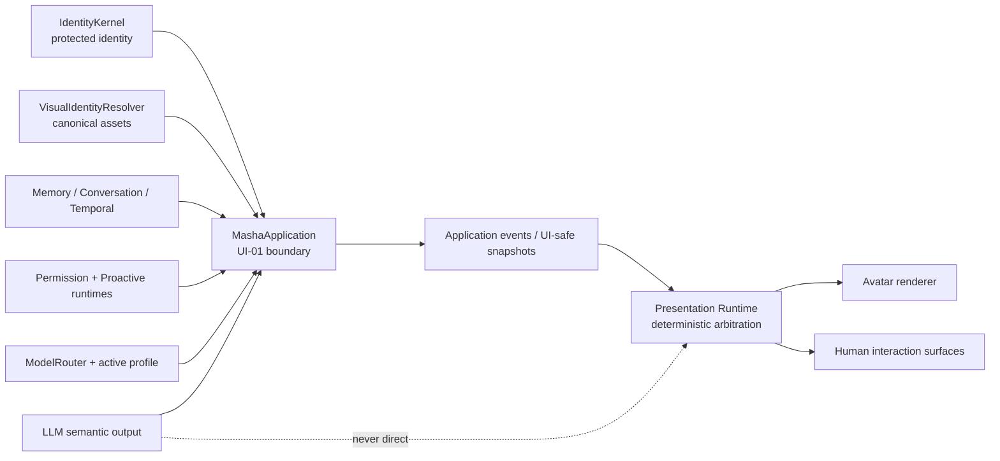
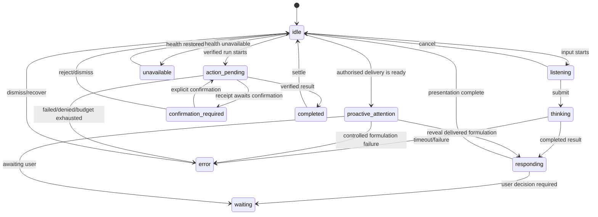

# UI-02 — Interaction & Presence Design Contract

Status: **DESIGN ONLY**

Date: **2026-08-11**

Scope: presentation and interaction contract for a future local UI. No frontend,
backend contract, domain model, storage schema or runtime behaviour is changed by
this document.

The framework-independent composable data model, Shared Room Surface contract
and capability integration boundary are refined in
[`UI-02_5_PRESENTATION_MODEL.md`](UI-02_5_PRESENTATION_MODEL.md).

## 1. Design intent

Masha Home is a shared local space in which Masha is present. It is not a chat
skin over a dashboard and not an admin panel with an avatar attached.

The design must preserve five qualities at the same time:

1. **Presence.** Masha is the visual and interaction centre of Home.
2. **Truthfulness.** Animation never claims that an action, permission, memory
   mutation or model capability exists when the backend has not confirmed it.
3. **Continuity.** A model-profile change changes the executor, not Masha's face,
   identity, memory, history or relationship continuity.
4. **Control.** Proactive contact and agent activity remain governed by existing
   deterministic policies, confirmation flows and emergency stop.
5. **Graceful locality.** The interface remains useful offline and on weak GPU
   hardware; richer rendering is an optional presentation tier.

The core rule is:

> Domain runtimes produce facts and permissions. Presentation Runtime interprets
> those facts into a bounded visual state. The LLM supplies words, never
> presentation authority.

## 2. Architectural boundaries



| Concern | Source of truth | Presentation may do | Presentation must not do |
|---|---|---|---|
| Identity | `IdentityKernel` and approved manifest | Render the stable name, character and canonical image | Rewrite traits or infer a new persona |
| Visual identity | Existing UI-01 `VisualIdentityResolver` | Resolve verified canonical bytes and render variants derived from an approved pack | Introduce a second face/asset manifest |
| Model execution | Active `ModelProfileStore` through `ModelRouter` | Show profile, display model and availability | Treat a profile as another Masha or add fallback |
| Runtime state | Conversation, proactive and agent application results | Map machine codes to interaction states | Infer success from fluent text |
| Safety state | `PermissionControlService` / `AutonomySafetyStore` | Display the persistent stop overlay and call existing controls | Resume work, edit grants or bypass stop |
| Proactive permission | `ProactiveDecisionEngine` plus persistent policy | Present an already authorised interaction | Turn attention animation into permission |
| Memory mutation | Existing proposal/confirmation services | Present preview and explicit confirmation | Save from ordinary dialogue or animation |
| Presentation preference | Future local UI configuration | Store tier, motion and privacy preferences | Put these preferences into Identity or Memory |

Presentation Runtime is a local, replaceable adapter. It is not part of Masha's
Identity and is not allowed to write domain state.

## 3. Interaction state model

### 3.1 Why this is not one flat enum

`autonomy_stopped`, `proactive_off`, `model_unavailable`, `manual_runtime` and
`background_runtime` can coexist with an ordinary conversation. For example,
emergency stop blocks autonomous activity but intentionally leaves chat
available. Treating all of these as mutually exclusive states would produce
false UI semantics.

The contract therefore has one **primary interaction state** and four
independent **operating overlays**.

```text
PresentationSnapshot
  sequence                 monotonic local sequence
  primary_state            InteractionState
  entered_at               local monotonic timestamp
  source                    machine-readable application event
  activity                  optional bounded ActivityPresentation
  expression                controlled ExpressionCue
  overlays
    safety_state            autonomy_active | autonomy_stopped
    proactive_state         proactive_off | proactive_on
    proactive_level         0..5
    model_state             model_available | model_switching | model_unavailable
    runtime_mode            manual_runtime | background_runtime
    background_running      true | false
```

Human-readable labels are presentation catalog data. They are never parsed back
to drive transitions.

### 3.2 Primary states

| Machine value | Semantic meaning | Default visual treatment | Lifetime | Interruptibility | Source / priority |
|---|---|---|---|---|---|
| `idle` | Masha is available; no active foreground interaction | relaxed pose, neutral/warm expression, bounded idle motion | indefinite | any foreground event | default / lowest |
| `listening` | User is actively composing or future voice capture is active | gaze toward interaction surface, quieter idle motion | until submit/cancel | user cancel, safety overlay | local input lifecycle |
| `thinking` | A submitted turn is being processed | restrained gaze shift, no fake progress percentage | until result/timeout | new cancel only when supported | application call in progress |
| `responding` | A confirmed assistant result is being presented | speaking/readout motion, response-linked but bounded expression | until text reveal or future audio ends | user may skip/interrupt | successful result |
| `waiting` | No computation is claimed; the system is waiting for user or a future external condition | still attentive pose and one clear waiting reason | indefinite | user response/cancel | runtime evidence only |
| `proactive_attention` | An already policy-authorised local candidate is being brought into the shared space | brief gaze/pose change and one subtle ambient pulse | 2–6 s, then response/wait/idle | direct user interaction | approved proactive result |
| `action_pending` | A bounded agent operation is known and is running or about to run | compact activity line near Masha; low-amplitude purposeful motion | until receipt changes | stop/cancel where supported | Agent Run receipt |
| `confirmation_required` | An existing proposal or agent step requires Misha's explicit decision | stable decision shelf with preview and ordinary buttons | until accept/reject | ordinary chat remains possible | proposal/permission source |
| `completed` | A real operation or turn reached a verified terminal success | short settling motion and human summary | 1.5–4 s, then idle | direct user interaction | verified completion only |
| `unavailable` | The application core cannot provide the requested interaction | Masha remains visible, motion reduced, clear recovery path | until health changes | settings/retry | application health |
| `error` | A controlled failure occurred without proving completion | quiet interruption, plain reason, retry/details affordance | 4–8 s then idle/degraded | direct user interaction | stable error code |

`model_unavailable` is deliberately an overlay, not a replacement for Masha:
local settings, history inspection and other deterministic functions can remain
usable. `unavailable` is reserved for a broader application failure.

### 3.3 Allowed transition graph



Overlay changes do not force a primary transition. Engaging emergency stop while
Masha is responding changes `safety_state` immediately, stops autonomous visual
motion and future autonomous steps, but does not erase the response or end chat.

### 3.4 Transition events

The future implementation should use closed machine-readable event names, for
example `INPUT_STARTED`, `TURN_SUBMITTED`, `TURN_COMPLETED`,
`TURN_MODEL_UNAVAILABLE`, `PROACTIVE_DELIVERY_READY`, `AGENT_RECEIPT_CHANGED`,
`CONFIRMATION_REQUIRED`, `SAFETY_ENGAGED` and `SAFETY_RELEASED`.

Events must carry only bounded UI-safe references. SQL rows, paths, audit payloads,
Ollama endpoints and private context do not enter Presentation Runtime.

## 4. Avatar state model

The avatar is composed from orthogonal layers so an expression does not replace
an interaction fact:

1. **Canonical identity layer** — verified appearance from the existing visual
   identity resolver.
2. **Base pose layer** — idle, attentive, speaking, waiting or unavailable.
3. **Expression layer** — one controlled expression cue with clamped intensity.
4. **Micro-motion layer** — blink, breathing, gaze and small head movement.
5. **Speech layer** — future visemes/speaking motion; currently text cadence only.
6. **Operating overlay layer** — safety, proactive, model and runtime state.

The current manifest contains canonical static assets, not an expression rig or
pose atlas. UI-03 can start with verified imagery plus subtle transforms. A later
approved visual asset pack may add rig/pose metadata, but it must reference the
canonical visual identity rather than become a new source of truth.

## 5. Controlled expression vocabulary

Initial vocabulary is intentionally limited to 16 machine values:

| Value | Use | Guardrail |
|---|---|---|
| `neutral` | stable default | never read as indifference |
| `attentive` | user focus, waiting | not a claim of understanding |
| `curious` | question or exploration | no diagnostic inference |
| `warm_smile` | greeting, gentle connection | not automatic praise |
| `amused` | light humour | restrained intensity |
| `laughing` | clear humorous moment | short, never during serious/error states |
| `thoughtful` | processing or reflection | not proof of model reasoning |
| `surprised` | explicit unexpected result | never from private inference |
| `skeptical` | explicit disagreement or doubt | characterful, not contemptuous |
| `slightly_annoyed` | bounded frustration or a friendly push | never punitive or humiliating |
| `concerned` | explicit troubling context | absence alone cannot trigger it |
| `serious` | safety, important decision, failure | calm rather than alarmist |
| `sympathetic` | explicit difficult experience | no diagnosis or therapeutic pose |
| `happy` | clear positive event | not generic reward animation |
| `proud` | verified accomplishment | only after a real result |
| `sleepy` | quiet/late idle presentation | never blocks interaction |

`listening`, `thinking` and `responding` remain interaction states, not emotions.
This prevents the vocabulary from mixing runtime truth with character acting.

For UI-03, state-based expressions are sufficient. Response-sensitive cues are
a later gap: the current `ConversationTurnResult` contains text and outcome but
no trusted semantic presentation cue. If added later, a cue must be a closed
provider-independent enum produced or validated by the application layer. Raw
LLM emotion labels can only be suggestions and may never bypass state, safety or
intensity constraints.

## 6. Procedural animation model

Animation is primarily code and authored assets, not per-frame generation.

### 6.1 Local deterministic controllers

- **Blink:** bounded pseudo-random interval, approximately 3.5–8 seconds; seeded
  locally for repeatable tests and paused when the window is hidden.
- **Breathing:** slow low-amplitude loop, reduced in listening and disabled in
  reduced-motion mode.
- **Gaze:** bounded target changes; user/input surface during listening, slight
  side shift during thinking, return toward user when responding.
- **Head movement:** small authored offsets, no continuous bobbing.
- **Micro-expression:** short blend into a whitelisted expression and smooth
  return to the base face.
- **Speaking:** text reveal cadence in Tier 0/1; future visemes are a separate
  speech layer in Tier 2.
- **Proactive attention:** one authored attention gesture after backend
  authorisation, never a repeating demand for attention.

Every controller has maximum amplitude, duration, update rate and cooldown.
Transitions blend rather than hard-cut unless safety or accessibility requires
an immediate stop.

### 6.2 Reduced motion

Reduced-motion mode removes breathing, head drift, repeated pulses and spatial
movement. State changes remain perceivable through expression swaps, opacity,
text and icons. Essential transitions are short crossfades. The user can also
disable avatar motion independently of the rendering tier.

## 7. Priority and arbitration

A single numeric animation queue is insufficient because safety must remain
visible without taking ordinary conversation away. Arbitration therefore has
two phases.

### Phase A — non-negotiable constraints

1. Accessibility and privacy visibility rules.
2. Emergency-stop overlay and suppression of autonomous animation.
3. Actual backend availability and permission facts.

### Phase B — foreground attention

1. Direct user interaction (`listening`, `thinking`, `responding`).
2. Explicit confirmation required.
3. Controlled error/unavailable recovery.
4. Approved proactive attention.
5. Active agent action.
6. Verified completion.
7. Idle motion.

Direct interaction outranks proactive attention because Misha has already chosen
to engage. Confirmation remains persistently visible even when not foreground.
Emergency stop is not a full-screen red error: it is a persistent high-trust
overlay that disables autonomous tracks while leaving Masha present.

## 8. Proactive visual language

The only valid path is:

```text
Temporal/Event Runtime
→ ProactiveDecisionEngine
→ persistent user policy
→ authorised candidate
→ local formulation through active profile
→ delivery state
→ Presentation Runtime
```

An approved contact is presented as Masha briefly turning attention toward the
user, followed by the human text. The normal surface shows no event UUID,
candidate state or audit payload. `dismiss`/`acknowledge` are quiet contextual
actions and use the existing interaction lifecycle.

If formulation fails or the model is unavailable, the UI shows the real model
state and does not fabricate a check-in. When the app is not foreground or the
privacy mode hides content, only a generic local attention indicator is shown;
sensitive text waits inside the app.

### 8.1 Proactive levels

The interface must be honest about current runtime semantics:

| Level | Human concept | Current factual behaviour | Proposed visual language |
|---|---|---|---|
| 0 | «Только отвечай мне» | all proactive contact suppressed | calm closed ambient ring; no attention animation |
| 1 | «Напоминай об обязательствах» | Commitment reminders may be authorised | one subtle marker shaped as a small open ring; label on focus |
| 2 | «Можешь иногда спросить, как я» | reminders plus bounded CHECK_IN may be authorised | gently breathing open ring; explicit label in settings |
| 3 | reserved | currently no behaviour beyond level 2 | do not imply extra powers; show «ещё не настроен» |
| 4 | reserved | currently no separate controlled-action semantics | do not imply agent authority; show «ещё не настроен» |
| 5 | forbidden class | not implemented | unavailable/locked, with plain explanation |

Numbers can remain in advanced details, but the normal control uses these human
phrases plus shape and text. Colour is only supplementary. Distinct Level 3/4
behaviour requires a future user-approved backend decision; UI-02 does not invent
it.

## 9. Autonomy and emergency-stop language

### Autonomy active

Masha has her normal visual presence. A small ambient autonomy mark is visible
on focus/hover and in the compact presence rail. It does not pulse continuously.

### Autonomy stopped

- Masha remains fully visible and ordinary chat stays enabled.
- Autonomous idle cues associated with initiative stop; neutral breathing may
  remain if motion is enabled.
- A calm persistent mark and text say: **«Автономность остановлена. Я рядом и
  могу отвечать, но сама ничего не запускаю.»**
- Pending actions show `blocked_by_safety`; they are not silently resumed.
- Resume is an explicit ordinary control with confirmation of consequence:
  releasing the latch starts nothing.

`proactive_off` is visually different: it means Masha will not initiate contact,
but it does not necessarily stop separately granted agent actions. The UI must
never merge these two concepts into one toggle.

## 10. Model switching presentation

The Home presence rail shows a human label such as:

```text
Маша · Primary · Qwen 3.5 9B · локально
```

Normal UI exposes profile display name, friendly model name, capabilities and
availability. The technical `execution_model_id` belongs in expanded diagnostic
details only.

Switch flow:

1. User opens the compact executor chooser.
2. UI presents enabled local profiles and actual availability.
3. While the existing availability check runs, overlay is `model_switching` and
   the phrase is «Проверяю исполнитель…».
4. `APPLIED` changes only the executor label.
5. `REJECTED` leaves the old profile visibly active and shows the stable reason.

No face swap, entrance animation or personality reset occurs. No fallback is
offered. `model_unavailable` reduces speaking/thinking presentation but leaves
Masha's image, history and deterministic controls visible.

## 11. Activity Surface

Activity is a single contextual surface attached to Masha's presence, not a log
wall. Its collapsed form answers one question: **«Что сейчас происходит?»**

Examples:

```text
Смотрю структуру проекта…
Жду твоего подтверждения: установить навык
Не могу продолжить: автономность остановлена
Готово: проверила конфигурацию
```

Expanded details may show steps, duration, scope, source skill and human actions,
but technical IDs stay in diagnostic mode. Completed items collapse after a
short confirmation and remain accessible from a bounded activity history.

The presentation contract for a future `ActivityPresentation` should contain:

```text
activity_id          opaque UI-safe reference
kind                 conversation | proactive | agent | proposal
state                machine enum
title                human-safe application label
started_at           optional
updated_at           required
progress             optional determinate value; never invented
can_cancel           explicit capability
can_confirm          explicit capability
blocked_reason       stable code + human label
```

The UI must not infer `can_cancel` or `progress` from the task type.

## 12. Long-running agent task presentation

One interaction model covers long operations:

| Presentation state | Meaning | Current backend mapping |
|---|---|---|
| `running` | verified active work | `AgentRunStatus.RUNNING` |
| `waiting_for_user` | explicit decision required | `AWAITING_CONFIRMATION` |
| `waiting_for_external_event` | no work is running; waiting for a defined source | future only |
| `paused` | resumable work deliberately paused | future only |
| `completed` | deterministic verification succeeded | `COMPLETED` |
| `failed` | execution or verification failed | `FAILED` |
| `cancelled` | explicit cancellation persisted | future only |
| `blocked_by_safety` | emergency overlay prevents progress | derivable for new work; dedicated run state not present |
| `denied` | permission rejected | `DENIED` |
| `budget_exhausted` | bounded run limit reached | `BUDGET_EXHAUSTED` |

Future states are not shown as working controls until the backend supplies their
semantics. A run is never displayed as completed because the generated text says
so; only a verified receipt permits `completed`.

## 13. GPU presentation tiers

| Tier | Rendering | Minimum behaviour | Graceful fallback |
|---|---|---|---|
| `tier_0_static` | canonical verified image | expression-free state framing, text, crossfade, status overlays | always available |
| `tier_1_2d` | locally layered 2D rig or authored sprite/pose pack | blink, gaze, breathing, simple expression blends | falls back to Tier 0 preserving state |
| `tier_2_rich` | local 3D rig / blendshapes / richer authored animation | layered face, head and future viseme tracks | falls back to Tier 1 or 0 preserving state |

Tier is a presentation preference, never model capability or Identity. Automatic
performance degradation may reduce frame rate or tier only within a configured
local budget, must be visible in settings, and must not change the active LLM.
The avatar never disappears merely because the GPU is weak.

## 14. Voice readiness

Voice later reuses the same states:

- microphone capture → `listening`;
- recognition/turn processing → `thinking`;
- audio playback → `responding`;
- user barge-in → `responding` to `listening`;
- silence awaiting an answer → `waiting`.

Camera and microphone permissions, capture indicators and interruption rules are
future contracts. UI-02 does not add either capability. Text must remain a full
keyboard-accessible alternative to every voice interaction.

## 15. Accessibility

- Full keyboard path for message input, model selection, stop/resume,
  confirm/reject, dismiss and activity details.
- Visible focus, logical focus order and no focus stealing by proactive attention.
- Screen-reader live regions announce only meaningful state changes; idle motion
  and facial expressions are not repeatedly narrated.
- Every expression/state conveyed by motion or colour also has a text/icon cue.
- System reduced-motion preference is honoured by default, with an in-app motion
  control.
- Text reflow, zoom and high contrast must not move critical confirmations off
  screen.
- Proactive attention never flashes, shakes the whole window or repeats without
  a new authorised event.
- `skeptical` and `slightly_annoyed` remain visually subtle and are never the
  sole carrier of important meaning.

## 16. Privacy and visibility

Masha Home is local-first, but a visible screen can still leak private context.
Presentation therefore needs three visibility modes in future UI configuration:

1. **Open room:** conversation and activity are visible.
2. **Discreet room:** Masha and generic state are visible; message/activity text
   is hidden until user interaction.
3. **Hidden presence:** tray/compact state only; no conversation preview.

When the window loses focus, the system is locked or an always-on surface is
used, the default should be discreet: no Memory content, proactive wording,
commitment text or agent inputs appear. Generic phrases such as «Маша хочет
обратить твоё внимание» are sufficient.

Canonical asset resolution remains local and path-free through UI-01. Future
camera/microphone use must have unmistakable capture indicators and explicit
permission. No telemetry, external asset generation or cloud animation is part
of this contract.

## 17. Proposed Home composition

The proposed composition is **Shared Room**, not chat-with-sidebar.

```text
┌──────────────────────────────────────────────────────────────┐
│ Маша · Primary · локально            autonomy / privacy     │  Presence rail
├──────────────────────────────────────────────────────────────┤
│                                      │                       │
│       Conversation ribbon            │                       │
│       current exchange + input       │       МАША            │
│       history expands on demand      │   visual presence     │
│                                      │                       │
│                                      │ proactive attention   │
├──────────────────────────────────────┴───────────────────────┤
│ Activity: «Жду твоего решения…»       [Подробнее]            │
│ Decision shelf, only when required:   [Подтвердить] [Нет]    │
└──────────────────────────────────────────────────────────────┘
```

### Composition rules

- **Masha:** occupies roughly 55–65% of the main visual field on desktop and
  remains recognizable in compact layouts.
- **Conversation ribbon:** shows the current exchange and composer without
  becoming the whole screen; older history expands deliberately.
- **Proactive attention:** originates from Masha's pose/gaze and then appears as
  conversational text, not as a notification list.
- **Presence rail:** compact, always understandable operating truth: local model,
  privacy, proactive/autonomy state. Expanded technical detail is on demand.
- **Activity Surface:** one current human status at the lower edge; expands only
  when asked or when confirmation is required.
- **Decision shelf:** a stable explicit preview with ordinary accessible controls;
  never hidden behind avatar gestures.
- **Settings:** a quiet side drawer grouped by Presence, Initiative, Models,
  Skills/Permissions, Privacy and Diagnostics. It is not the Home default.

On narrow screens, visual presence remains at the top, the current exchange below
it, and the composer pinned last. Activity and confirmation become bottom sheets.

## 18. What UI-01 supports today

The following can be used without backend changes:

- synchronous local conversation result and bounded history;
- aggregate readiness, model availability, proactive setting, runtime mode,
  daemon running state, emergency-stop state and pending counts;
- engage/release emergency stop through the application boundary;
- verified canonical visual bytes without filesystem path leakage;
- list/current/use local model profiles with controlled failure and no fallback.

The UI can implement a minimal local `listening → thinking → responding` sequence
around the synchronous call on a worker thread. This sequence describes UI call
lifecycle only; it must not pretend to expose internal model reasoning.

## 19. Contract gaps found

These are gaps, not permission to change neighbouring subsystems:

1. **No observable application event stream.** UI-01 is synchronous. A future UI
   cannot distinguish routing, generation and persistence phases or stream text.
   UI-03 may start with local call-lifecycle events; true backend progress needs a
   separate application-level event contract.
2. **No public Activity read model.** `MashaApplication.status()` exposes counts,
   but not UI-safe pending proposal, proactive interaction or agent-run details.
3. **No public confirmation actions.** Memory/skill/agent confirmation services
   exist, but the UI-01 facade does not yet expose a unified preview/action
   contract.
4. **No presentation preference store.** Rendering tier, reduced motion and
   privacy visibility have no local operating config. This must remain separate
   from Identity, Memory and model profiles.
5. **No expression/rig asset contract.** Canonical images exist; expression
   variants, anchors, pose atlas and rig metadata do not.
6. **No trusted semantic presentation cue.** Model responses contain text, not a
   whitelisted application-validated expression intent. State-only animation is
   safe for the first frontend slice.
7. **Proactive levels 3–4 lack distinct runtime semantics.** The current code
   differentiates level 0, reminder permission at 1 and CHECK_IN permission at 2.
   UI must not advertise extra behaviour for 3–4 yet; level 5 remains forbidden.
8. **Long-running lifecycle is narrower than the desired UI vocabulary.** Agent
   receipts do not currently implement pause, external wait or cancel states.
9. **Cancellation capability is not exposed.** UI must not draw a working Cancel
   button until an operation explicitly declares it.

None of these gaps requires changing Identity, Memory, Commitment, Temporal,
Proactive decision semantics, LLM-03, Agent Loop, Permissions, Safety or SQLite
schema during UI-02.

## 20. UI-03 dependencies and minimal next slice

The smallest safe UI-03 is **Presentation Runtime Foundation**, still without a
full product frontend:

1. Define the immutable machine-readable `PresentationSnapshot`, primary enum,
   overlay enums and deterministic transition reducer.
2. Add an in-process adapter around current `MashaApplication` calls; do not
   modify domain services.
3. Map existing UI-01 status/result codes to state and overlays.
4. Provide Tier 0 renderer fixtures using the existing canonical visual resolver.
5. Add deterministic state-transition, priority, reduced-motion and emergency
   overlay tests.
6. Use a tiny local prototype harness only if needed to validate transitions;
   defer frontend-framework selection and richer avatar technology.

Activity detail, unified confirmations, presentation preferences, 2D rig assets,
voice and streaming should be separately approved UI-03.x slices.

## 21. Open design decisions requiring Misha's approval

1. **Home composition:** approve Shared Room (Masha dominant, conversation ribbon,
   contextual activity) or prefer a more traditional conversation-first layout.
2. **Default visibility:** should an unfocused Home default to `discreet room`, or
   may current conversation text remain visible on this single-user computer?
3. **Character sharpness:** approve `skeptical` and `slightly_annoyed` in the
   initial expression pack, including the rule that they remain subtle and never
   replace explicit text.
4. **Level 3–4 semantics:** leave them unavailable until separately designed, or
   define their real deterministic permissions before exposing them in UI.
5. **Initial presentation tier:** begin with Tier 0 plus subtle transforms, or
   budget immediately for a local layered 2D asset pack.
6. **Response-sensitive expression:** keep UI-03 state-only, or later approve a
   whitelisted semantic cue validated outside the LLM.
7. **Proactive attention persistence:** after the one-time gesture, should an
   unanswered contact remain as a quiet presence mark until normal reply, or only
   live in conversation history?
8. **Completion visibility:** choose how long verified completions stay near
   Masha before moving into bounded activity history.

## 22. Research inputs

Research was reviewed on 2026-08-11 and used as input, not as a template to copy.

- [Unity Animation State Machines](https://docs.unity3d.com/6000.0/Documentation/Manual/AnimationStateMachines.html): authored states, parameters and transitions are a mature foundation for character behaviour. Masha adopts the separation between state, transition and animation layer, while keeping domain permission outside the animator.
- [NVIDIA Audio2Face-3D parameter guidance](https://docs.nvidia.com/ace/audio2face-3d-microservice/1.0/text/param-tuning.html): production facial systems clamp, smooth and blend bounded emotion/shape parameters. This supports a small controlled vocabulary, intensity limits and transition smoothing instead of arbitrary LLM-driven facial output.
- [Apple Live Activities HIG](https://developer.apple.com/design/human-interface-guidelines/live-activities): long-running work benefits from glanceable, compact/expanded presentations, updates only on meaningful changes and direct relevant actions. It also explicitly warns against exposing sensitive content on ambient surfaces.
- [Microsoft Guidelines for Human-AI Interaction](https://www.microsoft.com/en-us/research/?p=564561): clarify capabilities and limits, support efficient dismissal/correction, explain why a system acted and provide global controls. These map directly to proactive dismissal, no false progress and visible safety control.
- [Google PAIR — Mental Models](https://pair.withgoogle.com/guidebook-v2/chapter/mental-models/): anthropomorphic interfaces can cause people to overestimate capability and disclose more. Masha can feel alive while the UI remains explicit about local model limits and real authority.
- [MDN `prefers-reduced-motion`](https://developer.mozilla.org/en-US/docs/Web/CSS/Reference/At-rules/%40media/prefers-reduced-motion): user motion preferences should remove or replace non-essential movement. This informs an accessibility constraint above animation priority.
- [Apple Privacy HIG](https://developer.apple.com/design/human-interface-guidelines/privacy/): microphone/camera access requires clear purpose and user control. Voice/camera readiness therefore stays an explicit future boundary, never ambiently enabled.

The practical conclusion is strong: deterministic state and procedural animation
should be the default runtime. AI-assisted speech/facial tooling can become an
optional bounded renderer later, but it must consume application-approved intent
and cannot own state, permission, identity or safety.

---

## UI-02 STATUS

**DESIGN ONLY**

No frontend or production code is implemented by UI-02.

The framework-independent runtime foundation and interactive Tier 0 adapter
were subsequently implemented in
[`UI-03_PRESENTATION_RUNTIME.md`](UI-03_PRESENTATION_RUNTIME.md).
