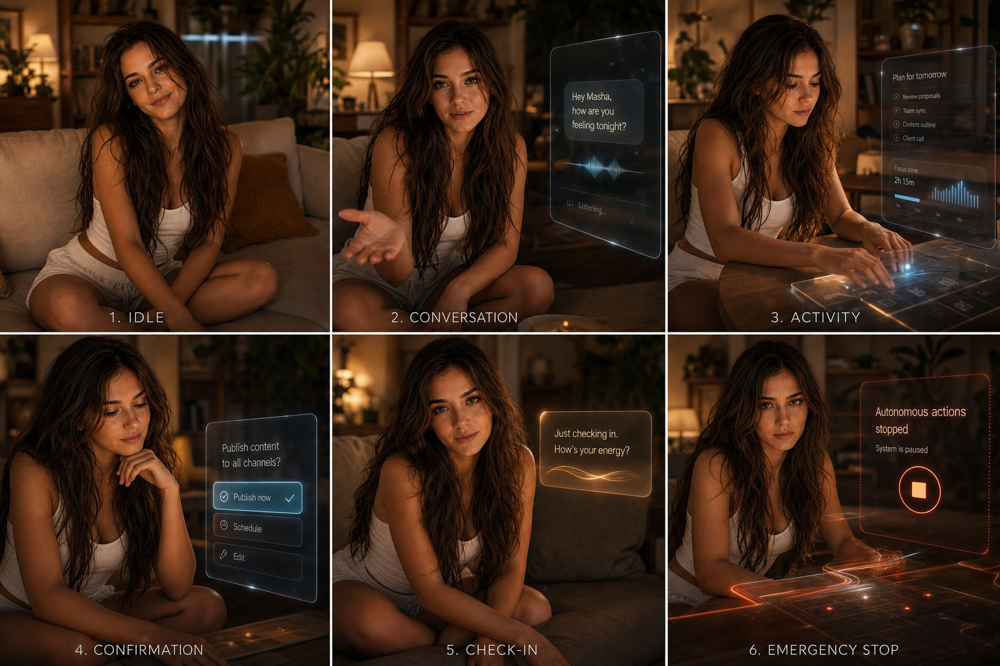
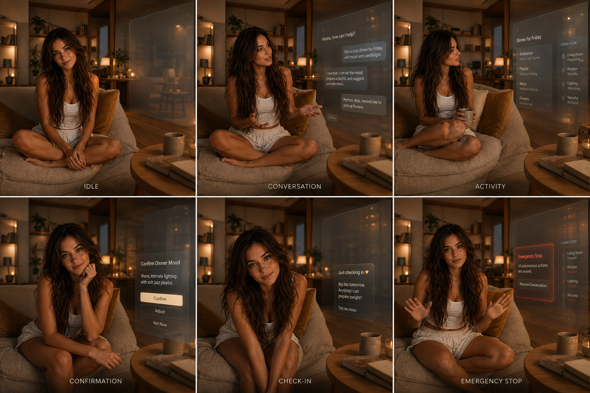
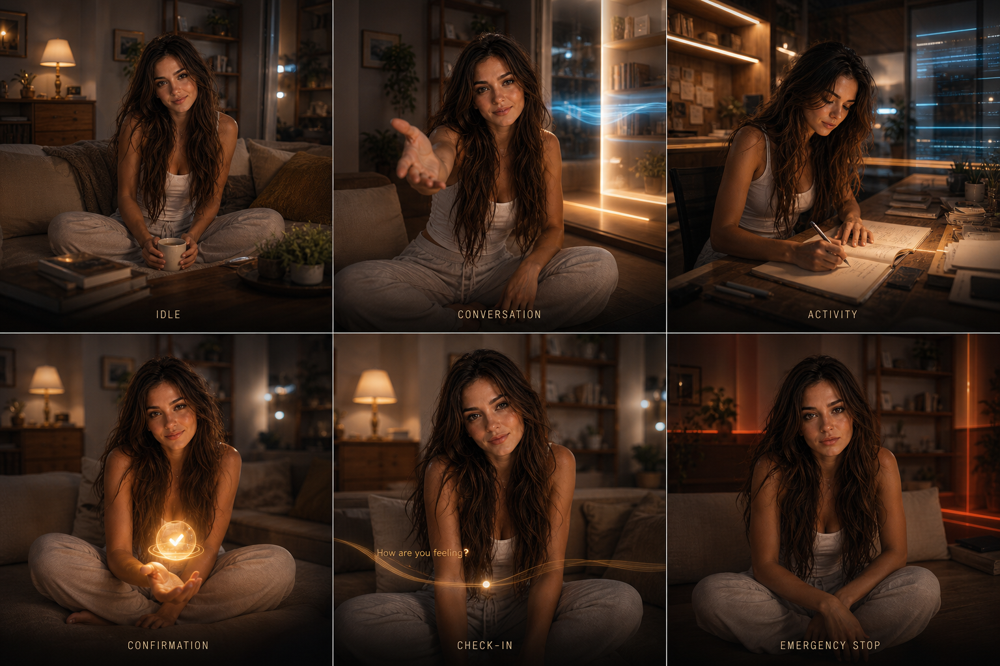
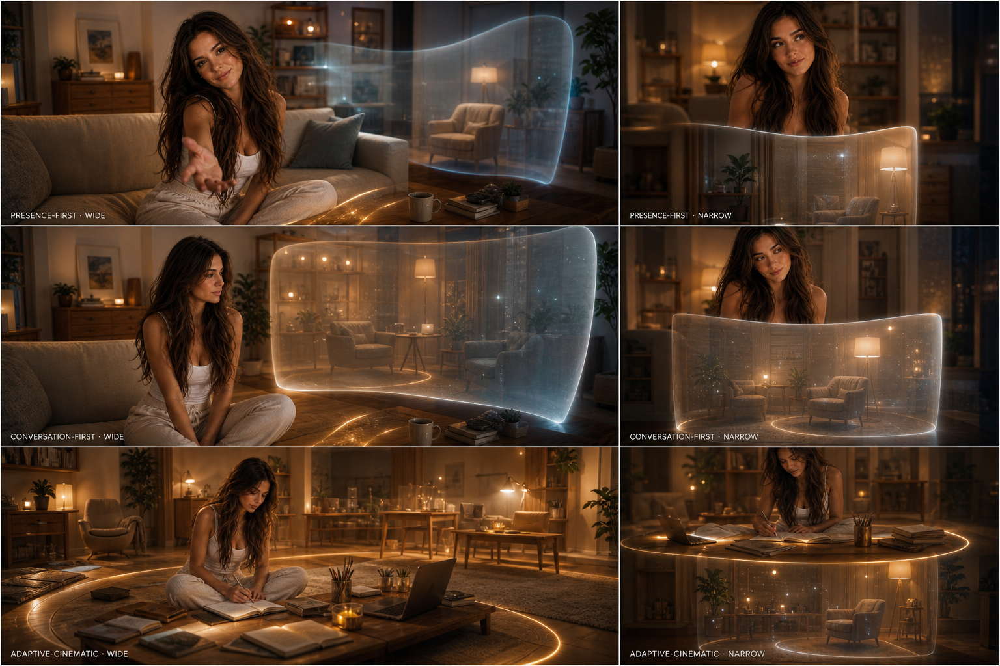

# UI-04C — Visual Composition Review

Статус: **MOCKUPS READY / USER REVIEW REQUIRED**

Дата: **2026-08-11**

## Purpose

UI-04C визуализирует три существующих `CompositionVariant` как три направления
одного Masha Home. Это не новый runtime, не production frontend и не выбор
победителя.

Все boards используют одну визуальную основу:

- тёплая полуреалистичная комната;
- Маша по существующим visual references;
- мягкий cinematic near-future слой;
- Conversation справа или рядом с общим focus;
- пространственные Activity, Confirmation, Check-in и Safety manifestations;
- отсутствие постоянного dashboard chrome.

## A — Presence first



Проверяемая идея:

- Маша и комната остаются главным визуальным содержанием;
- Conversation раскрывается справа и не забирает весь кадр;
- Activity появляется как отдельная рабочая зона;
- check-in начинается с внимания Маши;
- emergency stop останавливает autonomous layer, но не убирает Машу.

## B — Conversation first



Проверяемая идея:

- Conversation получает больше устойчивого пространства;
- Маша остаётся живым участником, а не avatar widget;
- Activity может сосуществовать с разговором;
- Confirmation вырастает из текущего контекста;
- emergency stop сохраняет доступность разговора.

## C — Adaptive cinematic



Проверяемая идея:

- комната сильнее меняет свет, глубину и shared-focus geometry;
- Activity способна временно превратить комнату в рабочую студию;
- Confirmation собирает рассеянное внимание в один объект;
- check-in может существовать почти без панели;
- emergency stop выражается остановкой пространственных light paths.

## Responsive comparison



Responsive board проверяет не конкретные breakpoints, а сохранение иерархии:

```text
wide
→ Masha centre-left + primary Surface right + supporting trace

narrow
→ Masha remains visible + primary Surface stacks meaningfully
  + at most one compact supporting trace
```

Narrow здесь означает узкое desktop-окно, а не mobile application.

## Cross-state coverage

Каждое из трёх направлений показывает:

1. Idle;
2. ordinary Conversation;
3. Activity;
4. Confirmation;
5. proactive Check-in;
6. Emergency Stop.

## Review dimensions

| Dimension | A — Presence first | B — Conversation first | C — Adaptive cinematic |
|---|---|---|---|
| Сила присутствия Маши | максимальная | высокая | зависит от текущего действия |
| Пространство разговора | мягкое, контекстное | крупное и устойчивое | трансформируемое |
| Activity | отдельная рабочая зона | соседствует с Conversation | меняет shared room сильнее всего |
| Check-in | личный жест + whisper Surface | входит в Conversation space | почти ambient manifestation |
| Safety | локальная boundary | разговор остаётся явно доступным | замораживает spatial transformation |
| Визуальный риск | функции могут быть слишком тихими | может приблизиться к обычному chat UI | может стать излишне театральным |

Таблица не является рейтингом и не фиксирует выбор.

## Disposable boundaries

Эти изображения предназначены только для совместного выбора композиции.

Не считаются утверждёнными:

- точная внешность, одежда и позы Маши;
- тексты и внутреннее содержимое surfaces;
- форма glass/light manifestations;
- цветовая палитра и интенсивность эффектов;
- camera framing;
- конкретный renderer или animation engine;
- pixel geometry и responsive breakpoints.

Image generation может давать небольшие различия лица, рук, предметов и комнаты
между frames. Это limitation mockup, а не предлагаемый runtime behaviour.

## Review questions

1. В каком варианте сильнее ощущается именно Дом Маши, а не приложение?
2. Достаточно ли места и визуального веса остаётся у Маши в B и C?
3. Нужно ли Conversation существовать почти постоянно или естественно исчезать?
4. Какие manifestations ближе: glass planes, light ribbons или изменение самой
   комнаты и освещения?
5. Какой emergency stop понятнее без ощущения аварийной панели?
6. Нужно ли взять один вариант целиком или собрать утверждённый hybrid из A/B/C?

## Scope statement

UI-04C добавляет только disposable raster mockups и этот review document.
Presentation Runtime, `CompositionResolver`, domain services, LLM, SQLite и
production UI не изменены.
