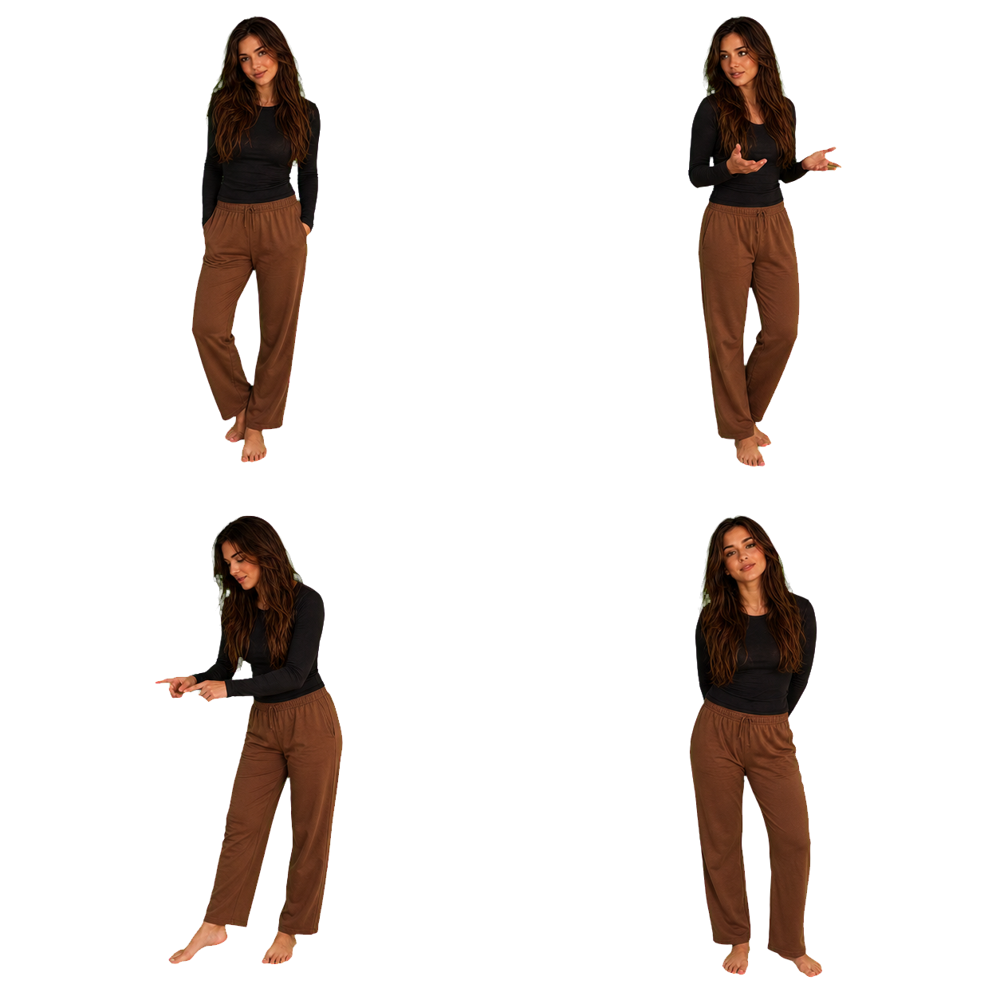
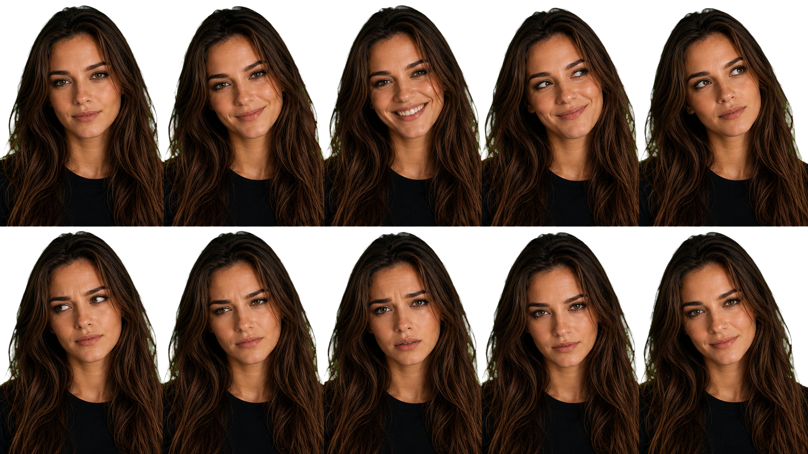
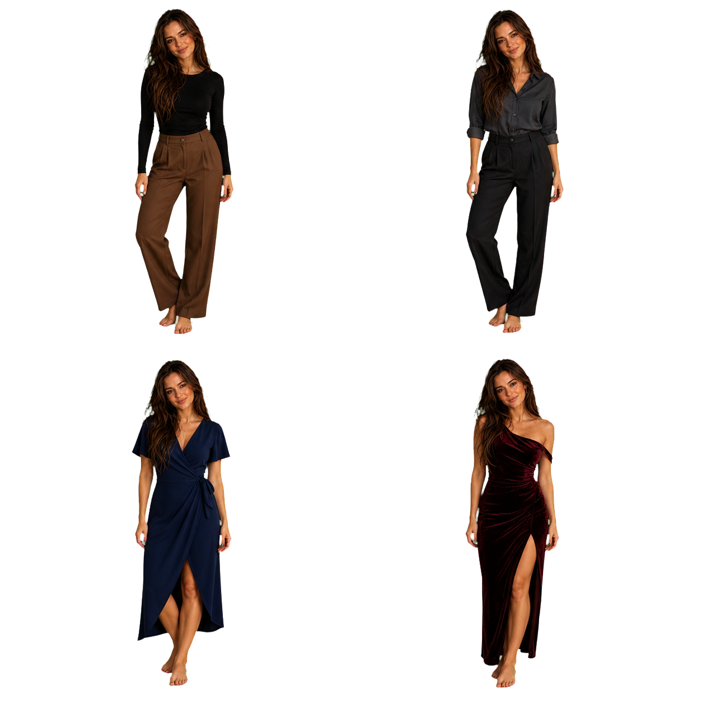

# UI-04E — Workshop Review Boards

Эти изображения — disposable authoring boards, а не production asset pack.

## Room

Проверить: ощущается ли пространство домом; хватает ли centre-left зоны для
Маши; не становится ли правая часть пустым dashboard slot.

## Pose atlas

Порядок: `idle`, `conversation`, `activity`, `attention`.

## Expression atlas

Верхний ряд: `neutral`, `warm`, `happy`, `amused`, `thoughtful`.

Нижний ряд: `skeptical`, `slightly_annoyed`, `concerned`, `focused`, `tender`.

Главный review: остаётся ли это одна Маша; читаются ли `skeptical` и
`slightly_annoyed` без карикатуры; нет ли uncanny valley.

## Outfit atlas

Порядок: `everyday`, `work`, `evening`, `special_evening`.

Проверить: достаточно ли отличаются состояния; остаётся ли `special_evening`
редким красивым образом, а не отдельным интерфейсным режимом.

## Review procedure

1. Открыть `prototypes/ui-04e/index.html`.
2. Пройти `1–8` с видимыми подсказками.
3. Нажать `H` и повторить Conversation, Activity, Confirmation, Check-in и
   Emergency Stop без chrome.
4. Проверить `E`, `A`, `P`, `O`, `S` стрелками.
5. В `M` выбрать переход и нажать `Space`.
6. Сузить desktop window до standard, narrow и very narrow.
7. Включить OS reduced motion и убедиться, что смысл остаётся читаемым.

Visual review не считается пройденным автоматически. Решение принимает Миша.
