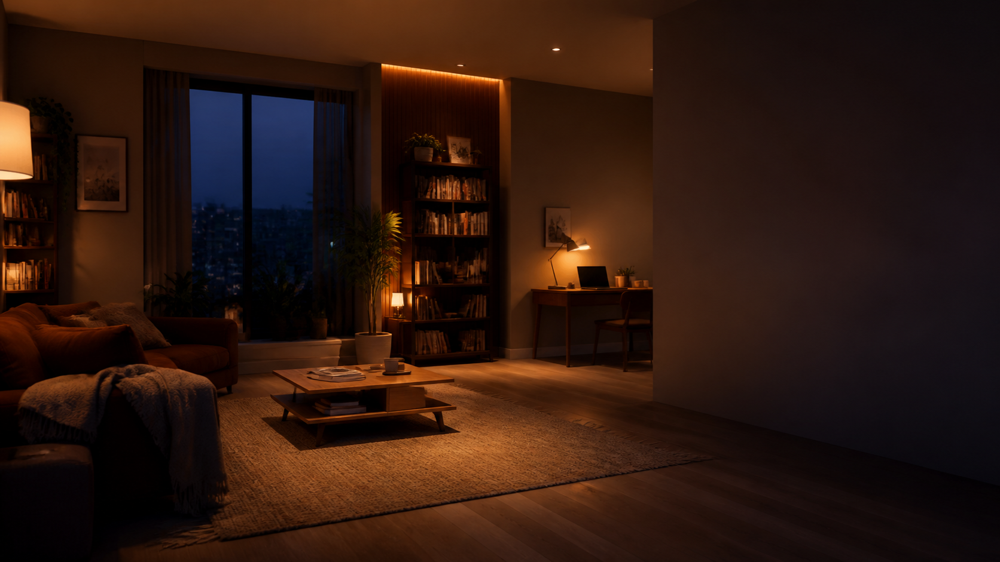
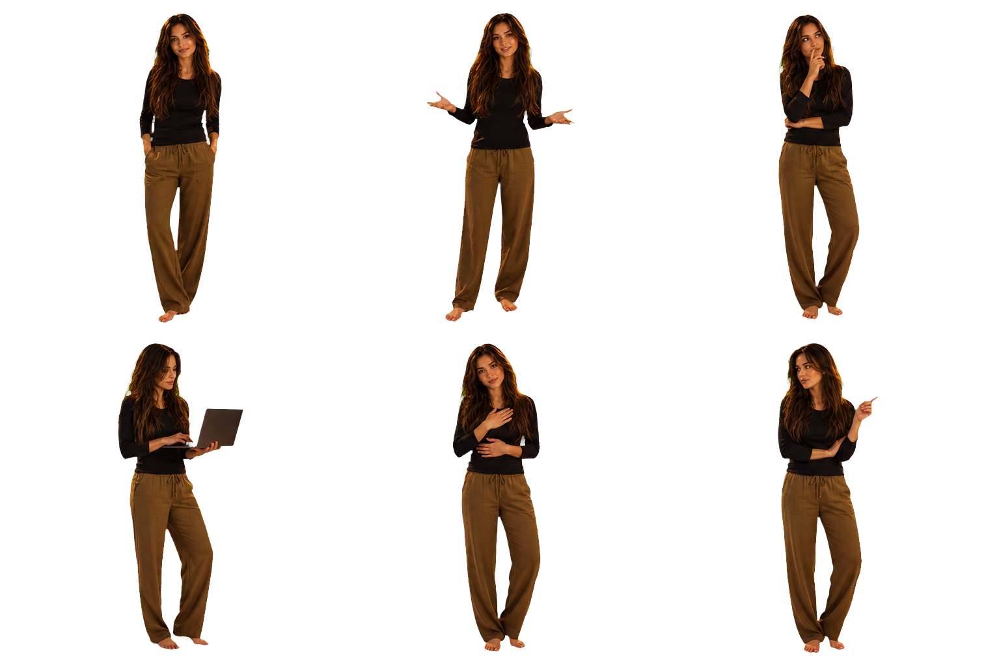

# UI-04F — Visual Review

## Canonical room

## Integrated character states

Порядок: `idle`, `conversation`, `thinking`, `working`, `attention_user`,
`attention_surface`.

Здесь лицо и тело уже являются одним asset. Проверить identity continuity,
scale, perspective и соответствие amber/blue свету комнаты.

## Evening states

Слева `home_evening`, справа `special_evening`.

## Review procedure

1. Открыть `prototypes/ui-04f/index.html`.
2. Нажимать `Space` от Idle до полного ambient return.
3. Проверить `1`–`8` с chrome.
4. Нажать `H` и повторить Conversation, Activity, Completed и Safety.
5. Сузить desktop window до standard, narrow и very narrow.
6. Включить `V` и проверить отсутствие личного текста.
7. Включить OS reduced motion и повторить vertical slice.
8. Зафиксировать visual verdict до любого выбора frontend framework.

Prototype успешен только после человеческого ответа на два вопроса:

> Маша действительно находится внутри комнаты, а не наклеена поверх неё?

> Без debug chrome понятно ли, что пространство разговаривает, работает,
> завершает задачу и возвращается к спокойствию?
