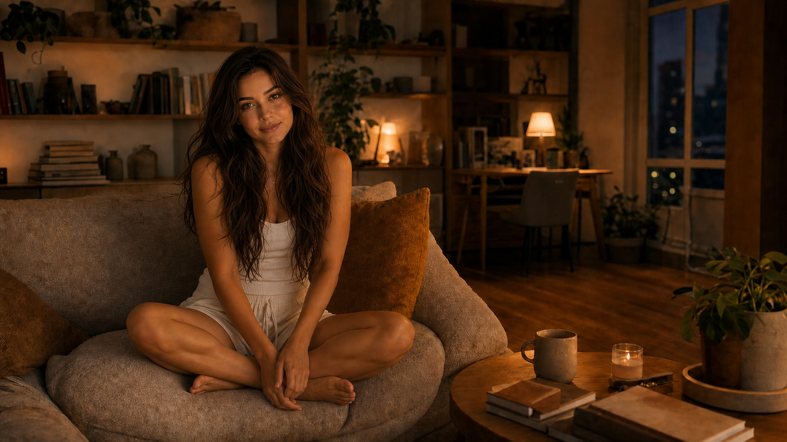
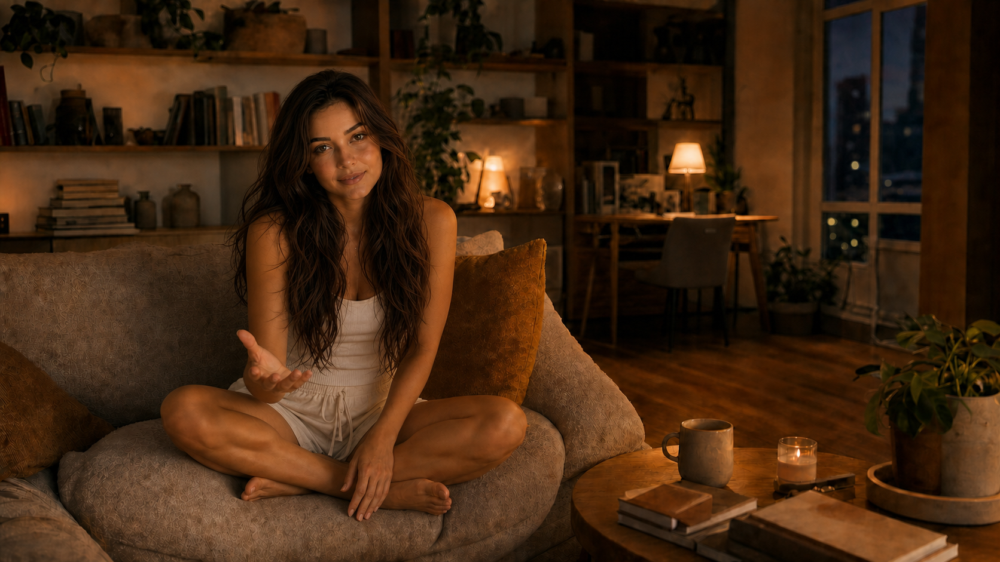
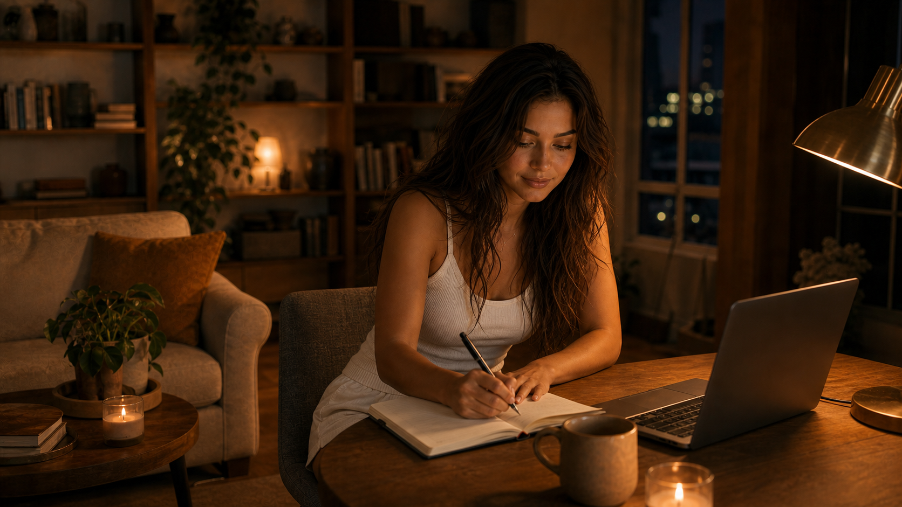
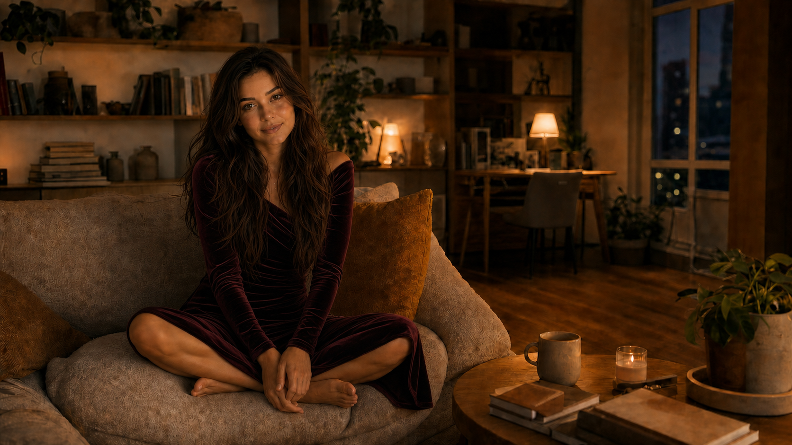

# UI-04G — Canonical Scene Family

Статус: **IN PROGRESS — RE-ANCHORED MASTER APPROVED / THREE SCENE CANDIDATES**

Дата: **2026-08-11**

## Цель

UI-04G заменяет неудачную схему `room + character cutout` на семейство
цельных фотографических сцен. Комната, Маша, мебель, контактные тени и основной
свет создаются вместе. Presentation Runtime и CompositionResolver продолжают
работать с opaque asset IDs и не получают визуальной или доменной власти.

## Canonical master



Пользователь утвердил этот кадр как канонические Машу и комнату. После первого
review лицо и волосы были re-anchored на выбранный ранний визуальный вариант:
ровный естественный тон кожи, мягкие черты, тёплый взгляд и длинные тёмно-
каштановые волосы с живым, но ухоженным объёмом. Этот master заменил прежний
visual anchor до дальнейшего расширения scene family.

Зафиксированы:

- одна вечерняя гостиная с доминирующей диванной зоной;
- рабочий стол в глубине справа;
- eye-level camera и широкая 16:9-композиция;
- Маша слева от центра, сидит на диване по-турецки;
- длинные тёмно-каштановые слегка растрёпанные волосы;
- белые домашние топ и шорты как `everyday` outfit;
- тёплый practical light и холодное ночное окно;
- свободная правая зона для restrained spatial surfaces.

Текущий raster имеет размер `1672x941`. Это утверждённый визуальный и
композиционный anchor, но не финальный 4K delivery asset. Финальный production
master должен быть подготовлен и проверен в `3840x2160` без изменения лица,
геометрии комнаты или кадра.

## Scene-family invariants

Следующие сцены обязаны сохранять:

- identity и естественную кожу Маши;
- архитектуру, мебель и постоянные предметы комнаты;
- camera height, focal language, crop и perspective;
- масштаб Маши и физический контакт с мебелью;
- общий light direction, color temperature и depth of field;
- правую quiet zone;
- корректные руки, ступни и видимые пальцы.

Не допускаются character cutout, chroma fringe, отдельный studio light на Маше,
перестановка комнаты, beauty-ad retouching и генеративное управление сценой в
runtime.

## Conversation candidate



Изменена только семантика присутствия: Маша немного подаётся вперёд, смотрит на
пользователя и делает небольшой открытый разговорный жест. UI и текст намеренно
отсутствуют, чтобы проверить label-free readability.

Предварительный visual audit:

- **Identity:** сцена пересобрана от утверждённого re-anchored master; требуется
  только review конкретного разговорного выражения и жеста.
- **Anatomy:** критических дефектов рук или ступней не обнаружено.
- **Contact / scale:** посадка, давление на диван и человеческий масштаб
  сохранены.
- **Room continuity:** архитектура, мебель, камера и правая quiet zone сохранены;
  небольшие генеративные различия мягких фактур допустимы только для workshop.
- **Label-free:** обращение к пользователю читается через взгляд, наклон и жест.
- **Digital layer:** не добавлялся; это отдельный следующий шаг после утверждения
  цельной сцены.

## Activity candidate



Маша находится у постоянного рабочего стола с блокнотом, ручкой и локальным
ноутбуком. Activity читается по физическому действию и направлению внимания, а не
по подписи, progress bar или dashboard panel.

Для деятельной сцены разрешён ограниченный authored camera reframe: камера
сохраняет eye-level высоту, 40–50mm photographic language, вечерний свет и
ориентацию комнаты, но мягко смещается к рабочей зоне. Статичный master crop
оставил бы Машу слишком маленькой и нарушил бы presence-first hierarchy.

Предварительный visual audit:

- **Identity:** сцена пересобрана от утверждённого re-anchored master; лицо,
  волосы, одежда и естественная фактура Маши сохранены.
- **Anatomy:** захват ручки, опорная рука, плечи и контакт со стулом выглядят
  правдоподобно; критических дефектов не обнаружено.
- **Room continuity:** диван остаётся слева, библиотека позади, окно и рабочая
  зона справа; сцена не зеркальна и не превращается в другую квартиру.
- **Lighting:** настольный practical light усиливает работу, сохраняя общую
  тёпло-холодную систему master scene.
- **Label-free:** работа с конкретной задачей читается без UI.
- **Privacy:** экран ноутбука не содержит различимого пользовательского текста.

## Special evening candidate



`special_evening` остаётся редким эстетическим состоянием, а не application
mode. После visual rejection первого candidate вторым вариантом используется
тёмно-винное бархатное вечернее платье с мягкой драпировкой. Отличие создают
образ, цвет и фактура, а не новое лицо, рекламная ретушь или технический mode.

Предварительный visual audit:

- **Identity:** v2 использует re-anchored canonical face и hair contract;
  прежний candidate не соответствует этому требованию и не является valid
  visual direction.
- **Room continuity:** мебель, постоянные ориентиры, поза и master camera
  сохранены.
- **Mood:** special state читается через одежду и более собранную вечернюю
  палитру, не превращая комнату в nightclub или showroom.
- **Boundaries:** skin остаётся естественной и матовой; нет UI, текста или
  отдельного technical mode.

## Approved workflow

```text
canonical master
→ one bounded full-scene edit
→ identity / anatomy / continuity audit
→ label-free review
→ human approval
→ next scene
```

Не создаются сразу десятки независимых изображений. После совместного review
Conversation, Activity и Special Evening следующим кандидатом станет
`Confirmation`: минимальная decision surface будет впервые проверена поверх
утверждённой цельной сцены, не меняя image assets и не превращая Дом в
dashboard.

## Boundaries

UI-04G не меняет backend, UI-01, Presentation Runtime, CompositionResolver,
Identity, Memory, Commitment, Safety, ModelRouter, Agent Loop или production
SQLite. Текущие PNG являются disposable workshop assets до завершения всего
visual review и 4K production pass.
